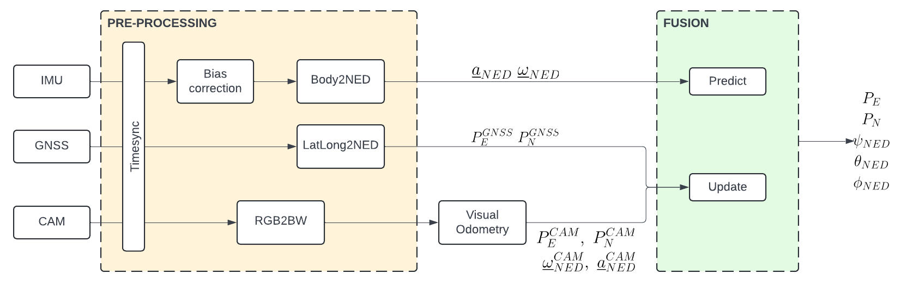

A concept of a sensor fusion system, considering data coming from IMU, GNSS and camera to estimate the position and orientation of a vehicle.

Click [here](sensor-fusion-system-with-ekf.pdf) for the complete report.
